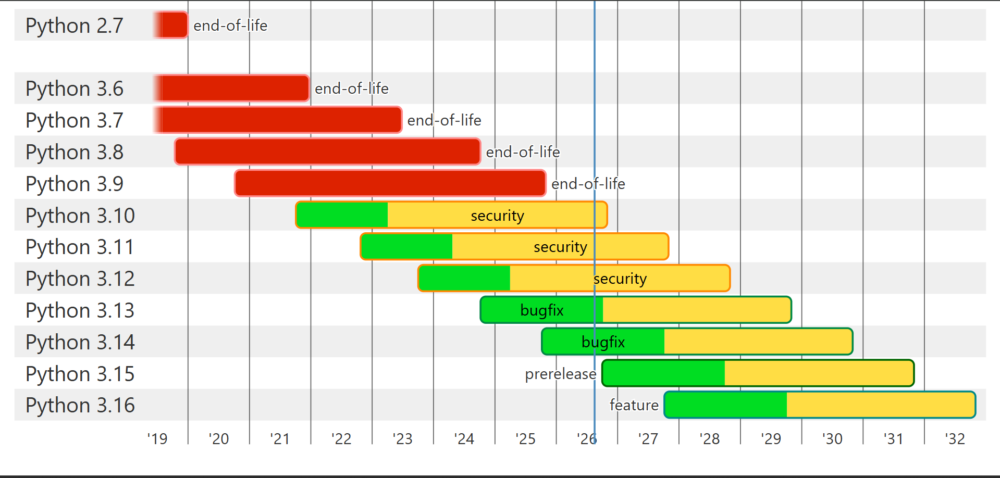

# 环境配置与基础规则

## 概览

在开始编写 Python 代码之前，需要配置好 Python 开发环境，并了解基础的代码编写与执行规则。

## Python 安装与环境配置

- **Python 版本**：推荐使用 Python 3.12 版本。
-
**安装包下载**：[点击下载 Python 3.12 (Windows 64-bit)](https://www.python.org/ftp/python/3.12.10/python-3.12.10-amd64.exe)
- **安装注意事项**：在安装界面中，务必勾选 `"Add python.exe to PATH"` 选项，以便在终端中直接使用 Python 命令。

### Python 版本趋势

## 代码编写与执行规则

- **标点符号**：写代码时，除了字符串（储存数据）或者打印文本，一般完全无法使用中文标点符号。
- **代码注释**：在代码文件中，以 `#` 开头的语句为注释，不会被 Python 解释器执行。
- **执行顺序**：Python 代码默认按从上至下、从左至右的顺序依次执行。
- **终端输出**：运行 `.py` 程序时会在终端打印文本，输出内容的先后顺序与代码中的执行顺序一一对应。

## 提示

如果在编辑器中 Markdown（`.md`）文件显示异常，可以尝试使用快捷键 `Ctrl + Shift + V` 打开预览窗口。
